# PSOC&trade; Edge MCU: BTstack OTA 

This code example demonstrates an over-the-air (OTA) firmware update via a Bluetooth&reg; interface using the Arm&reg; Cortex&reg; M33 CPU on Infineon's PSOC&trade; Edge MCU coupled with AIROC&trade; CYW55513 in the ModusToolbox&trade; environment. 

In this example, the host – typically a PC – establishes a Bluetooth&reg; Low Energy (BLE) connection with the target PSOC&trade; Edge device. On the next reboot, MCUboot-based Edge Protect Bootloader handles image verification and upgrades. The upgrade can either be overwrite-based or swap-based. 

- In an overwrite-based upgrade, the new image from the secondary slot is simply copied to the primary slot after a successful validation – with no way to revert the upgrade if the new image is inoperable

- In a swap-based upgrade, images in the primary and secondary slots are swapped. The upgrade can be reverted if the new image does not confirm its operation

This code example has a three project structure: CM33 secure, CM33 non-secure, and CM55 projects. All three projects are programmed to the external QSPI flash and executed in Execute in Place (XIP) mode. The extended boot launches the Edge Protect Bootloader from RRAM and the Edge Protect Bootloader launches the CM33 secure project from a fixed location in the external flash, which then configures the protection settings and launches the CM33 non-secure application. CM33 non-secure application handles the OTA task and enables the CM55 CPU.

The extended boot launches the Edge Protect bootloader present in RRAM from a fixed location. The bootloader then configures the external QSPI flash in XIP mode, validates all the three applications, and launches the cm33 secure application (*proj_cm33_s*). The cm33 secure application launches the cm33 non-secure application (*proj_cm33_ns*), which is responsible for DFU operations. Additionally, CM33 non-secure application enables the CM55 CPU and launches the CM55 application.

In the default configuration of the code example, secure boot and secure updates are is disabled. To learn more about how to enable these features, refer [AN237857: Edge Protect Bootloader for PSOC&trade; Edge](https://www.infineon.com/AN237857)

This example has been tested with the following (out-of-box) configurations:

1. Device lifecycle - Development
2. Secure Boot - Disabled 

To know more about the OTA library usage, see the README files of *ota-update* and *ota-bootloader-abstraction* libraries.

[View this README on GitHub.](https://github.com/Infineon/mtb-example-psoc-edge-btstack-ota)

[Provide feedback on this code example.](https://cypress.co1.qualtrics.com/jfe/form/SV_1NTns53sK2yiljn?Q_EED=eyJVbmlxdWUgRG9jIElkIjoiQ0UyMzk4MjAiLCJTcGVjIE51bWJlciI6IjAwMi0zOTgyMCIsIkRvYyBUaXRsZSI6IlBTT0MmdHJhZGU7IEVkZ2UgTUNVOiBCVHN0YWNrIE9UQSIsInJpZCI6InZhc3VtYSBuYXJheWFuYSIsIkRvYyB2ZXJzaW9uIjoiMi4wLjAiLCJEb2MgTGFuZ3VhZ2UiOiJFbmdsaXNoIiwiRG9jIERpdmlzaW9uIjoiTUNEIiwiRG9jIEJVIjoiSUNXIiwiRG9jIEZhbWlseSI6IlBTT0MifQ==)

See the [Design and implementation](docs/design_and_implementation.md) for the functional description of this code example.


## Requirements

- [ModusToolbox&trade;](https://www.infineon.com/modustoolbox) v3.6 or later (tested with v3.6)
- Board support package (BSP) minimum required version: 1.0.0
- Programming language: C
- Associated parts: All PSOC&trade; Edge E84 MCU parts
- Python (tested with v3.13.7)


## Supported toolchains (make variable 'TOOLCHAIN')

- GNU Arm&reg; Embedded Compiler v14.2.1 (`GCC_ARM`) – Default value of `TOOLCHAIN`
- Arm&reg; Compiler v6.22 (`ARM`)
- IAR C/C++ Compiler v9.50.2 (`IAR`)
- LLVM Embedded Toolchain for Arm&reg; v19.1.5 (`LLVM_ARM`)


## Supported kits (make variable 'TARGET')

- [PSOC&trade; Edge E84 Evaluation Kit](https://www.infineon.com/KIT_PSE84_EVAL) (`KIT_PSE84_EVAL_EPC2`) – Default value of `TARGET`
- [PSOC&trade; Edge E84 Evaluation Kit](https://www.infineon.com/KIT_PSE84_EVAL) (`KIT_PSE84_EVAL_EPC4`)


## Hardware setup

This example uses the board's default configuration. See the kit user guide to ensure that the board is configured correctly.

Ensure the following jumper and pin configuration on board:
- The BOOT SW pin (P17.6) is in the LOW/OFF position
- J20 and J21 are in the tristate/not connected (NC) position


## Software setup

See the [ModusToolbox&trade; tools package installation guide](https://www.infineon.com/ModusToolboxInstallguide) for information about installing and configuring the tools package.

Install a terminal emulator if you do not have one. Instructions in this document use [Tera Term](https://teratermproject.github.io/index-en.html).

This example requires no additional software or tools.


## Operation

<details><summary><b>Add the Edge Protect Bootloader to application</b></summary>

1. Add *proj_bootloader* to this code example as a first step. Follow steps 2 to 9 in the **Operation** section of the [Edge Protect Bootloader](https://github.com/Infineon/mtb-example-edge-protect-bootloader) code example's *README.md* file
  
  > **Note:** 
  > 1. [Edge Protect Bootloader](https://github.com/Infineon/mtb-example-edge-protect-bootloader) *README.md* describes how to add the bootloader to **Basic Secure App**. Add it to **this** code example instead
  > 2. (For the `LLVM_ARM` compiler) **Edge Protect Bootloader** does not support `LLVM_ARM`. In the *proj_bootloader* directory, edit the *Makefile* to force other supported compilers for EPB (for example: `TOOLCHAIN=GCC_ARM`)
 
</details>

<details><summary><b>Configure the memory map</b></summary>

2. Configure the memory map: this code example bundles a custom *design.modus* file compatible with the Edge Protect Bootloader. Hence, you need not make any further customizations here to use EPB and this project together

</details>

<details><summary><b>Build and program the bootloader and application </b></summary>

3. Open the *common.mk* file in the root of the application and set the `COMBINE_SIGN_JSON` variables to the configurator-generated *boot_with_bldr.json* file as shown here:

    ```
    COMBINE_SIGN_JSON?=./bsps/TARGET_$(TARGET)/config/GeneratedSource/boot_with_bldr.json
    ```

4. Ensure IMG_TYPE is set to BOOT as shown below 

    ```
     IMG_TYPE=BOOT
    ```

5. Build and program the application. See [Using the code example](docs/using_the_code_example.md) for instructions on creating a project, opening it in various supported IDEs, and performing tasks, such as building, programming, and debugging the application within the respective IDEs

6. After programming, the application starts automatically. Confirm "PSOC Edge MCU : BTSTACK OTA Application" is displayed on the UART terminal

   **Figure 1. Terminal output on program startup**

   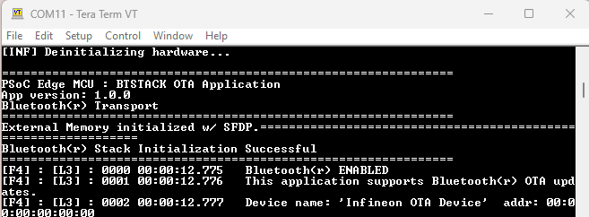

</details>

<details><summary><b>Build the application image for the overwrite update</b></summary>

To perform the updates, build the image in update mode as described: 

7. Open the *common.mk* file and set `IMG_TYPE` to `UPDATE` as shown: 

    ```
     IMG_TYPE=UPDATE
    ```

8. In the same *common.mk* file, ensure `UPDATE_TYPE?=` is set to `overwrite`. This code example is configured to work in **overwrite** mode in its default configuration

      ```
      UPDATE_TYPE?=overwrite
      ```
    
  > **Note:** When you set the `IMG_TYPE` to `UPDATE`, the `COMBINE_SIGN_JSON` variable is set automatically in *common.mk*, depending on the value of `UPDATE_TYPE`

9. Clean and build the application; **do not program** the application. See [Using the code example](docs/using_the_code_example.md) for instructions on creating a project, opening it in various supported IDEs, and performing tasks such as cleaning and building the application.

</details>

<details><summary><b>Perform the update</b></summary>

10. Open the shell command window and navigate to the *<My_BTSTACK_OTA_example>/scripts/* directory

  > **Note:** On Windows, use the command line modus-shell program provided in the ModusToolbox&trade; installation instead of a standard Windows command line application. You can access it by typing "modus-shell" in the search box on the Windows menu

11. Reset your kit, and once you see the message **Device name: 'Infineon OTA Device'** on the terminal window, immediately execute the following command in the shell command window:

    ```
    ./WsOtaUpgrade.exe /file ./../build/ota-update.tar
    ```
   
  > **Note:** 
  > 1. the *ota-update.tar* file is generated in the *<My_BTSTACK_OTA_example>/build/* directory when the code example is compiled with `IMG_TYPE?=UPDATE`
  > 2.  See [btsdk-peer-apps-ota](https://github.com/Infineon/btsdk-peer-apps-ota) for more information on the btsdk peer applications

12. When the command above is executed, a new window opens, as shown below. Select **Infineon OTA Device** > **OK**

 **Figure 2. Select Infineon OTA Device**

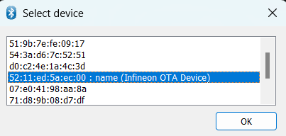

13. After device selection, **Start** the image transfer for the firmware upgrade

 **Figure 3.Start firmware upgrade**
 
 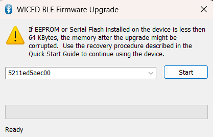
 

 **Figure 4. Terminal output for firmware transfer**

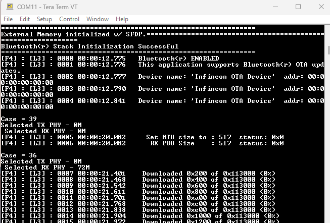


14.  After successful transfer, you will see the success message on the window. Application will issue a *DEVICE RESET* on successful download of the application 

 **Figure 5. Firmware transfer successful**
 
 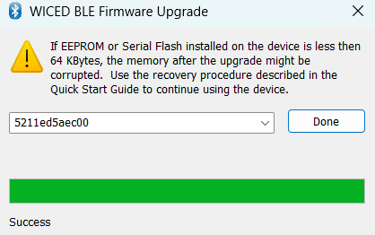

 
 **Figure 6. Terminal output for firmware transfer completed**

 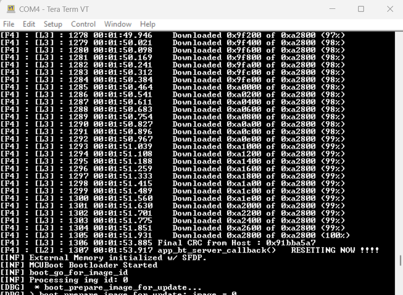


15. On next reset, the Edge Protect Bootloader will validate the images in the secondary slot, copy them to the primary slot, and boot the application 

 **Figure 7. Terminal output for image validation** 

 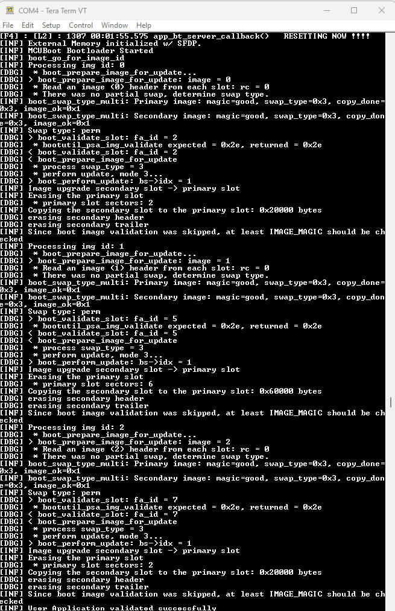


16. After a successful image upgrade, observe the following display message on the terminal window. Verify the application version is for the upgraded image:

 **Figure 8. Upgrade image**

 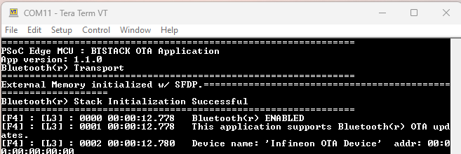


**Figure 9. Terminal output for booting upgrade image**
   
 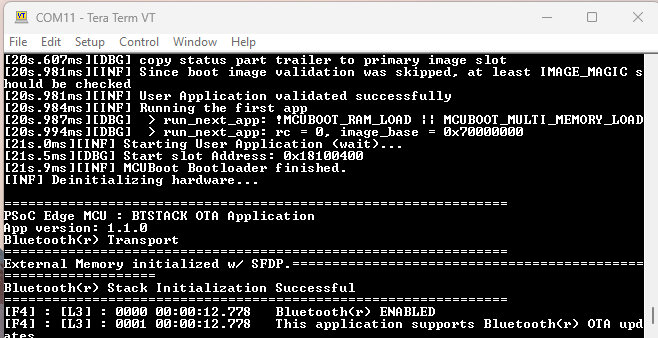

</details>

<details><summary><b>Update by SWAP</b></summary>

17. Open *common.mk* and set `IMG_TYPE` to `BOOT` and `UPDATE_TYPE` to `swap` as shown:

    ```
     IMG_TYPE=BOOT
    ```

    ```
    UPDATE_TYPE?=swap
    ```
    
  > **Note:** When you select the `IMG_TYPE` to `UPDATE`, `COMBINE_SIGN_JSON` variable is set automatically in the *common.mk* file, depending on the value of `UPDATE_TYPE`

18. Navigate to **Memory** tab in the Device Configurator and confirm the **swap_scratch** and **swap_status** regions exist, as shown below:

**Figure 10. Terminal output for configuring Memory for swap**
   
 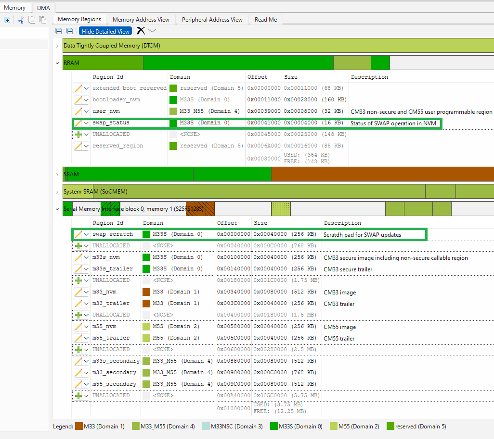
 
19. Navigate to **Solutions** > **Edge Protect Bootloader Solution** and set **UPDATE_TYPE** to **swap**

**Figure 11. Terminal output for configuring bootloader solution for swap**
   
 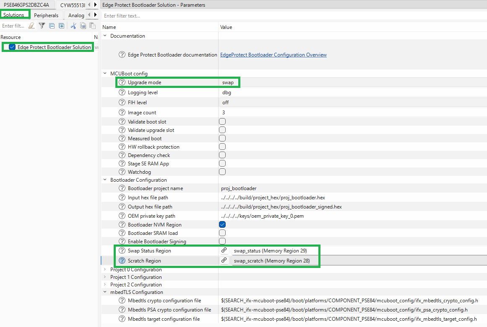

20. Build and program the application. See [Using the code example](docs/using_the_code_example.md) for instructions on creating a project, opening it in various supported IDEs, and performing tasks, such as building, programming, and debugging the application within the respective IDEs

21. To perform the updates, repeat the steps described in the [Performing the updates](#Performing the updates) section of the document. Observe the console logs for a successful update

</details>

<details><summary><b>Configure the memory map</b></summary>

2. Configure the memory map: this code example bundles a custom *design.modus* file compatible with the Edge Protect Bootloader. Hence, you need not make any further customizations here to use EPB and this project together

</details>
## Related resources

Resources  | Links
-----------|----------------------------------
Application notes  | [AN235935](https://www.infineon.com/AN235935) – Getting started with PSOC&trade; Edge E84 MCU on ModusToolbox&trade; software
Code examples  | [Using ModusToolbox&trade;](https://github.com/Infineon/Code-Examples-for-ModusToolbox-Software) on GitHub
Device documentation | [PSOC&trade; Edge E84 MCU datasheet](https://www.infineon.com/products/microcontroller/32-bit-psoc-arm-cortex/32-bit-psoc-edge-arm/psoc-edge-e84#Documents) <br> [PSOC&trade; Edge E84 MCU reference manuals](https://www.infineon.com/products/microcontroller/32-bit-psoc-arm-cortex/32-bit-psoc-edge-arm/psoc-edge-e84#Documents)
Development kits | Select your kits from the [Evaluation board finder](https://www.infineon.com/cms/en/design-support/finder-selection-tools/product-finder/evaluation-board)
Libraries  | [mtb-dsl-pse8xxgp](https://github.com/Infineon/mtb-dsl-pse8xxgp) – Device support library for PSE8XXGP <br> [retarget-io](https://github.com/Infineon/retarget-io) – Utility library to retarget STDIO messages to a UART port <br> [serial-memory](https://github.com/Infineon/serial-memory) - Serial Flash Middleware for External memory interface <br> [DFU](https://github.com/Infineon/dfu) – Device Firmware Update Middleware (DFU MW) <br> [emusb-device](https://github.com/Infineon/emusb-device) – USB Device stack for embedded applications
Tools  | [ModusToolbox&trade;](https://www.infineon.com/modustoolbox) – ModusToolbox&trade; software is a collection of easy-to-use libraries and tools enabling rapid development with Infineon MCUs for applications ranging from wireless and cloud-connected systems, edge AI/ML, embedded sense and control, to wired USB connectivity using PSOC&trade; Industrial/IoT MCUs, AIROC&trade; Wi-Fi and Bluetooth&reg; connectivity devices, XMC&trade; Industrial MCUs, and EZ-USB&trade;/EZ-PD&trade; wired connectivity controllers. ModusToolbox&trade; incorporates a comprehensive set of BSPs, HAL, libraries, configuration tools, and provides support for industry-standard IDEs to fast-track your embedded application development

<br>


## Other resources

Infineon provides a wealth of data at [www.infineon.com](https://www.infineon.com) to help you select the right device, and quickly and effectively integrate it into your design.


## Document history

Document title: *CE239820 – PSOC&trade; Edge MCU: BTstack OTA*

 Version | Description of change
 ------- | ---------------------
 1.x.0   | New code example <br> Early access release
 2.0.0   | GitHub release
<br>


All referenced product or service names and trademarks are the property of their respective owners.

The Bluetooth&reg; word mark and logos are registered trademarks owned by Bluetooth SIG, Inc., and any use of such marks by Infineon is under license.

PSOC&trade;, formerly known as PSoC&trade;, is a trademark of Infineon Technologies. Any references to PSoC&trade; in this document or others shall be deemed to refer to PSOC&trade;.

---------------------------------------------------------

© Cypress Semiconductor Corporation, 2025. This document is the property of Cypress Semiconductor Corporation, an Infineon Technologies company, and its affiliates ("Cypress").  This document, including any software or firmware included or referenced in this document ("Software"), is owned by Cypress under the intellectual property laws and treaties of the United States and other countries worldwide.  Cypress reserves all rights under such laws and treaties and does not, except as specifically stated in this paragraph, grant any license under its patents, copyrights, trademarks, or other intellectual property rights.  If the Software is not accompanied by a license agreement and you do not otherwise have a written agreement with Cypress governing the use of the Software, then Cypress hereby grants you a personal, non-exclusive, nontransferable license (without the right to sublicense) (1) under its copyright rights in the Software (a) for Software provided in source code form, to modify and reproduce the Software solely for use with Cypress hardware products, only internally within your organization, and (b) to distribute the Software in binary code form externally to end users (either directly or indirectly through resellers and distributors), solely for use on Cypress hardware product units, and (2) under those claims of Cypress's patents that are infringed by the Software (as provided by Cypress, unmodified) to make, use, distribute, and import the Software solely for use with Cypress hardware products.  Any other use, reproduction, modification, translation, or compilation of the Software is prohibited.
<br>
TO THE EXTENT PERMITTED BY APPLICABLE LAW, CYPRESS MAKES NO WARRANTY OF ANY KIND, EXPRESS OR IMPLIED, WITH REGARD TO THIS DOCUMENT OR ANY SOFTWARE OR ACCOMPANYING HARDWARE, INCLUDING, BUT NOT LIMITED TO, THE IMPLIED WARRANTIES OF MERCHANTABILITY AND FITNESS FOR A PARTICULAR PURPOSE.  No computing device can be absolutely secure.  Therefore, despite security measures implemented in Cypress hardware or software products, Cypress shall have no liability arising out of any security breach, such as unauthorized access to or use of a Cypress product. CYPRESS DOES NOT REPRESENT, WARRANT, OR GUARANTEE THAT CYPRESS PRODUCTS, OR SYSTEMS CREATED USING CYPRESS PRODUCTS, WILL BE FREE FROM CORRUPTION, ATTACK, VIRUSES, INTERFERENCE, HACKING, DATA LOSS OR THEFT, OR OTHER SECURITY INTRUSION (collectively, "Security Breach").  Cypress disclaims any liability relating to any Security Breach, and you shall and hereby do release Cypress from any claim, damage, or other liability arising from any Security Breach.  In addition, the products described in these materials may contain design defects or errors known as errata which may cause the product to deviate from published specifications. To the extent permitted by applicable law, Cypress reserves the right to make changes to this document without further notice. Cypress does not assume any liability arising out of the application or use of any product or circuit described in this document. Any information provided in this document, including any sample design information or programming code, is provided only for reference purposes.  It is the responsibility of the user of this document to properly design, program, and test the functionality and safety of any application made of this information and any resulting product.  "High-Risk Device" means any device or system whose failure could cause personal injury, death, or property damage.  Examples of High-Risk Devices are weapons, nuclear installations, surgical implants, and other medical devices.  "Critical Component" means any component of a High-Risk Device whose failure to perform can be reasonably expected to cause, directly or indirectly, the failure of the High-Risk Device, or to affect its safety or effectiveness.  Cypress is not liable, in whole or in part, and you shall and hereby do release Cypress from any claim, damage, or other liability arising from any use of a Cypress product as a Critical Component in a High-Risk Device. You shall indemnify and hold Cypress, including its affiliates, and its directors, officers, employees, agents, distributors, and assigns harmless from and against all claims, costs, damages, and expenses, arising out of any claim, including claims for product liability, personal injury or death, or property damage arising from any use of a Cypress product as a Critical Component in a High-Risk Device. Cypress products are not intended or authorized for use as a Critical Component in any High-Risk Device except to the limited extent that (i) Cypress's published data sheet for the product explicitly states Cypress has qualified the product for use in a specific High-Risk Device, or (ii) Cypress has given you advance written authorization to use the product as a Critical Component in the specific High-Risk Device and you have signed a separate indemnification agreement.
<br>
Cypress, the Cypress logo, and combinations thereof, ModusToolbox, PSoC, CAPSENSE, EZ-USB, F-RAM, and TRAVEO are trademarks or registered trademarks of Cypress or a subsidiary of Cypress in the United States or in other countries. For a more complete list of Cypress trademarks, visit www.infineon.com. Other names and brands may be claimed as property of their respective owners.
